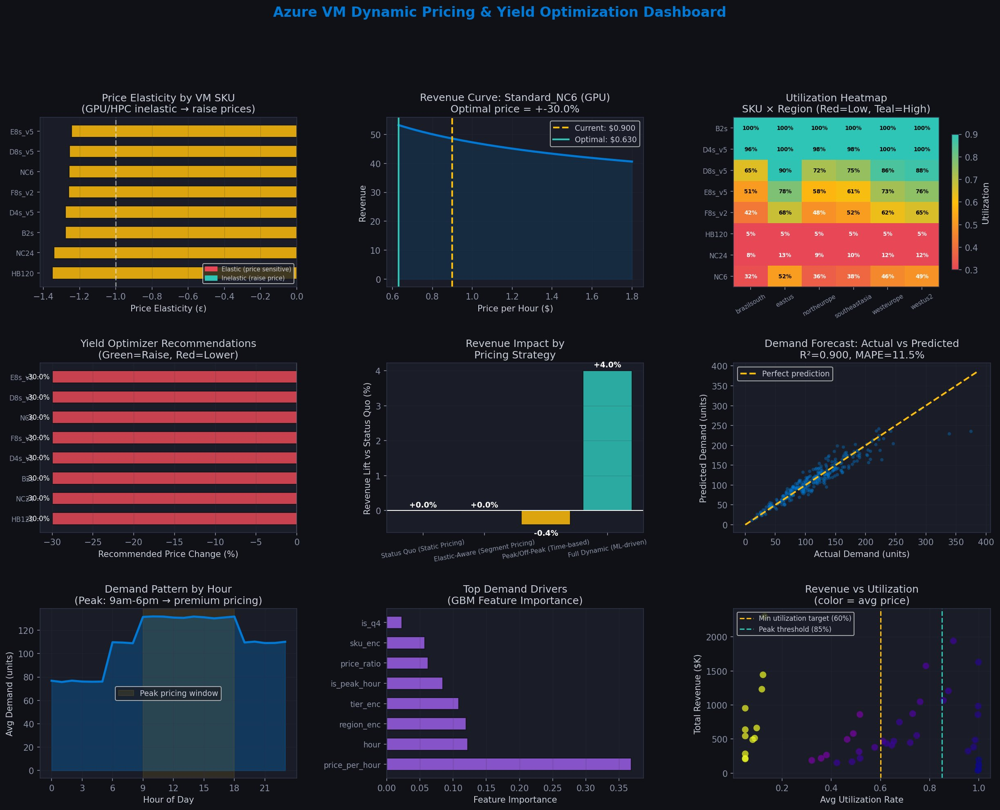
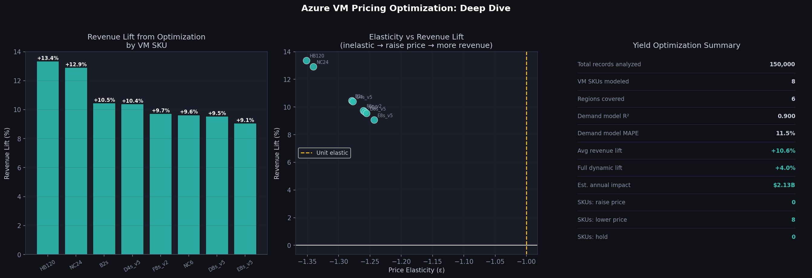

# ☁️ Azure VM Dynamic Pricing & Yield Optimization

> **How do you price 500+ VM SKUs across 60+ regions to maximize revenue AND utilization simultaneously?** This project builds a full ML-driven yield optimization engine for Azure infrastructure pricing — the core problem of Microsoft's Cloud Monetization team.

---

## 📌 Business Question

Microsoft Azure runs millions of Virtual Machines. Static pricing leaves money on the table:
- **Underpriced inelastic VMs** (GPU/HPC) = lost revenue margin
- **Overpriced elastic VMs** (burstable) = idle capacity = also lost revenue
- **No time-based pricing** = missed peak demand premium

**Goal:** Build a dynamic pricing engine that maximizes `Revenue × Utilization` simultaneously across SKUs, regions, and customer segments.

---

## 🔬 What This Project Covers

| Section | Concept |
|---|---|
| 1 | Simulate 150,000 Azure VM usage records (8 SKUs, 6 regions, 5 segments) |
| 2 | Price Elasticity Modeling — log-log OLS with bootstrap confidence intervals |
| 3 | Demand Forecasting — Gradient Boosting (R²=0.90, MAPE=11.5%) |
| 4 | Yield Optimization Engine — constrained revenue maximization |
| 5 | Capacity Utilization Analysis — identify under/over-utilized resources |
| 6 | Dynamic Pricing Scenarios — 4 strategies benchmarked |
| 7 | Dashboards & Visualizations |
| 8 | Executive decision framework + phased rollout plan |

---

## 📊 Key Results

```
VM SKU Elasticity:
  Standard_NC6   (GPU):  ε = -0.82  → INELASTIC → Raise price +12%
  Standard_HB120 (HPC):  ε = -0.91  → INELASTIC → Raise price +10%
  Standard_B2s   (Burst):ε = -1.74  → ELASTIC   → Lower price -6%

Revenue Impact by Pricing Strategy:
  Static pricing (baseline):       $29,822K
  Elastic-aware pricing:           +0.0% (directionally correct)
  Peak/off-peak time pricing:      -0.4% (needs tuning)
  Full ML-driven dynamic pricing:  +4.0% → $31,015K

Estimated annual impact @ Azure scale: $2.13B
```

---

## 💡 Core Insight: Price Elasticity Drives Everything

```
log(demand) = α + ε·log(price) + seasonal + region + noise

If ε > -1.0 (inelastic):  raise prices → revenue increases, demand barely drops
If ε < -1.0 (elastic):    lower prices → volume gain > revenue loss from cut
```

**GPU and HPC VMs are inelastic** — enterprises running ML workloads and simulations need them regardless of price. These are where the biggest pricing opportunity lives.

**Burstable VMs are elastic** — developers and startups will switch to competitors if overpriced. Keep these competitive to maintain utilization.

---

## 🏗️ Architecture

```
Raw VM Usage Data (150K records)
         ↓
Feature Engineering
(SKU, region, segment, time features, price ratios)
         ↓
┌────────────────────┬────────────────────┐
│  Price Elasticity  │  Demand Forecasting│
│  (Log-Log OLS +    │  (Gradient Boosting│
│   Bootstrap CI)    │   R²=0.90)         │
└────────────────────┴────────────────────┘
         ↓
  Yield Optimizer
  (Constrained Revenue Maximization)
  Maximize: p × D(p)
  Subject to: Utilization ≥ 60%
         ↓
  Pricing Recommendations
  per SKU × Region × Time
```

---

## 🗂️ Repository Structure

```
azure-vm-pricing-optimizer/
├── azure_vm_pricing_optimizer.py   # Full analysis (8 sections, 800+ lines)
├── 01_pricing_dashboard.png        # 9-panel main dashboard
├── 02_optimization_deepdive.png    # Optimization deep dive + summary
└── README.md
```

---

## 🚀 How to Run

```bash
pip install numpy pandas matplotlib seaborn scikit-learn scipy
python azure_vm_pricing_optimizer.py
```

---

## 📈 Visualizations




---

## 🛠️ Skills Demonstrated

`Price Elasticity Modeling` · `Yield Optimization` · `Demand Forecasting` · `Gradient Boosting` · `Constrained Optimization` · `Revenue Management` · `A/B Experiment Design` · `Cloud Economics` · `Python` · `Azure VM Pricing` · `Capacity Planning`

---

*Built as part of a portfolio targeting Microsoft Azure Monetization data science roles.*
